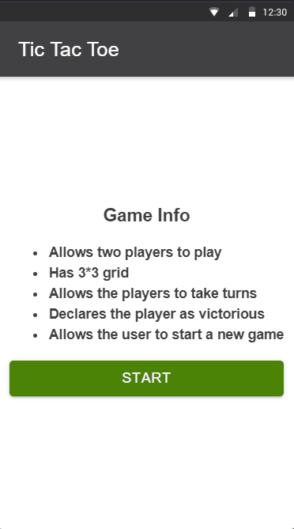

# Tic Tac Toe

Tic Tac Toe is a two player game where each player takes turn to mark X and O on a 3*3 grid. The player who succeds in placing three of their marks in a horizontal, vertical, or diagonal row is the winner.

## Demo


## Description

I have used Ionic 4 with Angular 8 to develop this project. For consistent User Experience I have used Ionic UI components library and customized it to include color combinations that we can see in Shipt's mobile apps. Game rules which are displayed in homepage comes from Firebase database. Gameboard component is reusable and can be imported to any page. 

## Prerequisites
* Node.js >=10
* NPM >= 6
* Android Studio (for Android Apps)
* Xcode (for iOS Apps)

## Installation
Clone the source locally
```bash
git clone https://github.com/sandeepshres/tic-tac-toe.git
cd tic-tac-toe
```

Install project dependencies
```bash
npm install
```

Test the app
```bash
ng test
```

Build the app
```bash
ng build
```

Serve the app
```bash
ionic serve --lab
```
## Built with
* [Ionic 4](https://ionicframework.com)
* [Firebase](https://firebase.google.com)

## Features
* Allows two players to play Tic Tac Toe
* Has 3*3 grid
* Allows the players to take turns marking spaces on the 3*3 grid
* Declares the player as winner
* Allows the user to start a new game

## Author
* Sandeep Shrestha

## Credits
* [Fireship.io](https://github.com/fireship-io/angular-tic-tac-toe)

## License
[MIT](https://choosealicense.com/licenses/mit/)